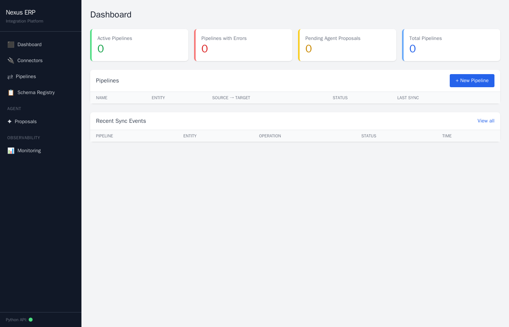
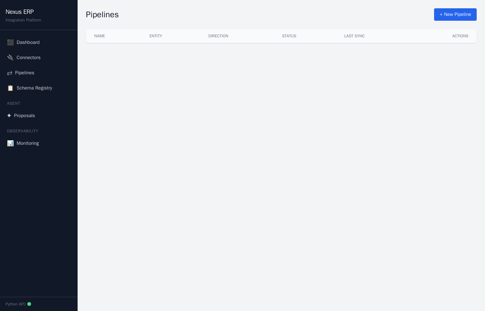
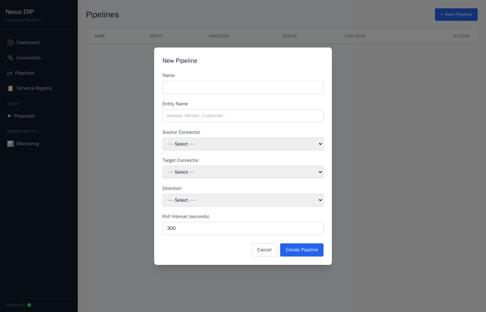
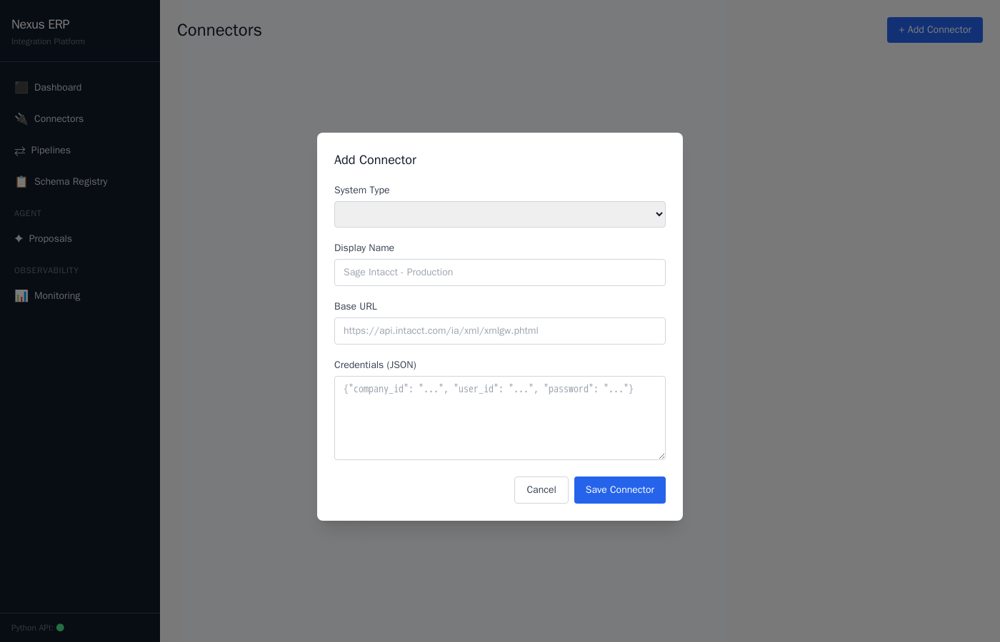
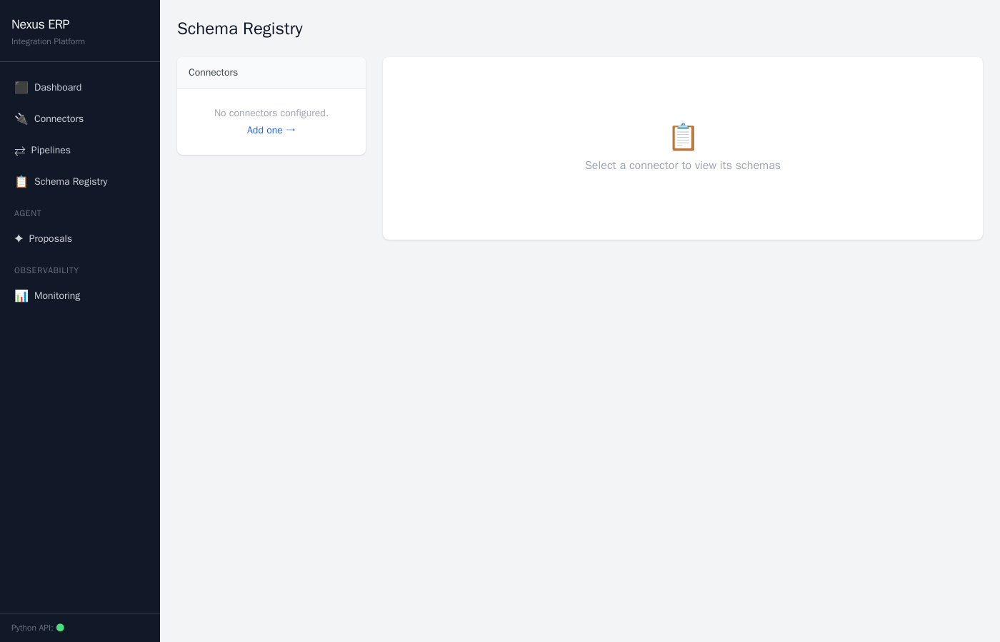
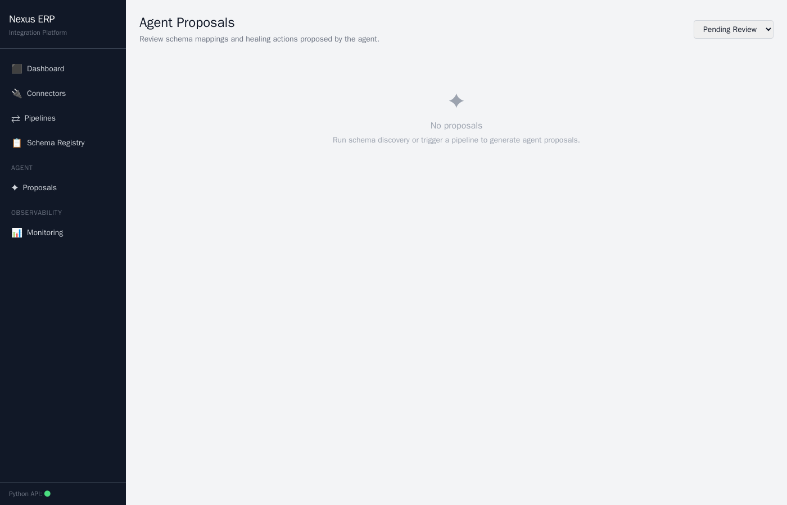
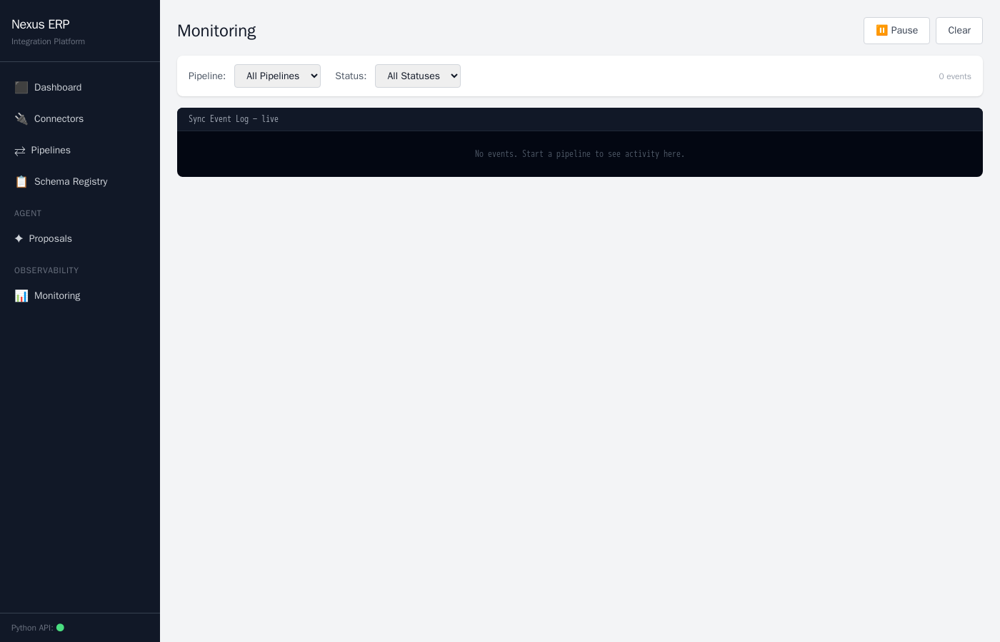

# Nexus ERP

Pluggable, bidirectional ERP integration platform with an AI-driven transformation layer. Connect Sage Intacct, Dynamics 365, SAP S/4HANA, NetSuite, Oracle ERP Cloud — or any custom ERP — without rebuilding the core.

---

## Screenshots

### Dashboard


### Pipelines


### New Pipeline


### Connectors


### Add Connector


### Schema Registry


### Agent Proposals


### Monitoring


---

## Architecture

```
┌─────────────────────────────────────────────────────────────┐
│  Phoenix LiveView UI  (port 4000)                           │
│  Real-time dashboards · Mapping editor · Agent proposals    │
└──────────────────────────┬──────────────────────────────────┘
                           │ HTTP (Req)
┌──────────────────────────▼──────────────────────────────────┐
│  FastAPI  (port 8000)                                        │
│  Connectors · Pipelines · Schema registry · Mappings        │
│  Agent API · Sync events · Health                           │
└───┬──────────────┬───────────────┬───────────────┬──────────┘
    │              │               │               │
┌───▼───┐    ┌─────▼────┐   ┌─────▼────┐   ┌─────▼────┐
│Celery │    │  Kafka   │   │  NAM     │   │  NNLM    │
│Worker │    │+ Zookeeper│  │port 30800│   │30001/2   │
└───┬───┘    └──────────┘   └──────────┘   └──────────┘
    │
┌───▼──────────────────────────────────────────────────────────┐
│  ERP Connectors (plugin architecture)                        │
│  Sage Intacct · Dynamics 365 · SAP S/4HANA                  │
│  NetSuite · Oracle ERP Cloud · custom plugins                │
└──────────────────────────────────────────────────────────────┘
```

**Stack:**
- **Backend**: Python 3.11, FastAPI, SQLAlchemy (async), Celery, APScheduler
- **Frontend**: Elixir 1.16, Phoenix LiveView 0.20, Tailwind CSS 3
- **Messaging**: Apache Kafka, Zookeeper
- **AI layer**: LangGraph, Anthropic Claude, NAM (Neural Addressed Memory), NNLM
- **Storage**: PostgreSQL 15, Redis 7
- **Infrastructure**: Docker Compose, Alembic migrations

---

## Features

### Pluggable Connector System
Each ERP connector implements the `ERPConnector` abstract base class. Drop a new connector into `plugins/` and it's auto-discovered at startup — no central registry edits required.

```
backend/connectors/
  sage_intacct/    # XML API + session auth
  dynamics365/     # MSAL OAuth2 + OData
  sap_s4hana/      # Basic auth + OData v4 + CSRF
  netsuite/        # TBA OAuth 1.0 + SuiteTalk REST
  oracle_erp/      # Basic auth + Oracle REST
plugins/           # drop third-party connectors here
```

### Bidirectional Sync
- **Direction**: source → target, target → source, or both
- **Conflict resolution**: last-write-wins by `updated_at`; Sage Intacct is the tie-breaker hub
- **Loop prevention**: `ExternalIdMap` table tracks source↔target record IDs and payload hashes — unchanged records are skipped, already-synced records are never re-synced in the opposite direction

### Schema Registry
Every connector's entity schemas are versioned. On each discovery run, a SHA-256 hash comparison detects drift and produces a structured diff `{added, removed, changed}`. Diffs trigger the healing agent automatically.

### AI-Driven Transformation Layer
1. **Schema mapping agent** — queries NNLM for grounded context from previously indexed schemas, then calls Claude to propose field mappings with confidence scores
2. **Code generation** — compiles approved mappings into `transform_forward` / `transform_reverse` Python functions, executed in a RestrictedPython sandbox (no imports allowed)
3. **Self-healing pipelines** — on schema drift, the healing agent retrieves relevant past mappings from NAM via NNLM and proposes updated transformations
4. **Human-in-the-loop** — LangGraph pauses at `human_checkpoint`; proposals are reviewed via the Phoenix UI before any code is applied

### NAM + NNLM Integration
NAM and NNLM run as external services (Kubernetes NodePort) and are **integrated**, not deployed by this stack.

- **NAM** (`port 30800`): Neural Addressed Memory — stores schema definitions, approved mappings, and sync events as semantically addressed records
- **NNLM encoder** (`port 30001`): multi-agent retrieval pipeline — supervisor → entity resolver → NAM query → quality gate
- **NNLM decoder** (`port 30002`): grounded synthesis with citation tracking — LLM outputs are constrained to indexed facts, preventing hallucination

Docker containers reach these services via `host.docker.internal`.

---

## Getting Started

### Prerequisites
- Docker + Docker Compose
- NAM running on host port `30800` (NodePort)
- NNLM encoder on host port `30001`, decoder on `30002`
- An Anthropic API key

### 1. Configure environment

```bash
cp .env.example .env
```

Edit `.env` and set at minimum:
```
ANTHROPIC_API_KEY=sk-ant-...
FERNET_KEY=<generate: python3 -c "from cryptography.fernet import Fernet; print(Fernet.generate_key().decode())">
```

### 2. Start the stack

```bash
docker compose up --build
```

This starts: PostgreSQL, Redis, Kafka, Zookeeper, FastAPI API, Celery worker, Phoenix UI.

NAM and NNLM are **not started** by this compose file — they must already be running.

### 3. Run database migrations

```bash
docker compose exec api alembic upgrade head
```

Or in development mode (non-Docker), set `APP_ENV=development` and tables are auto-created at startup.

### 4. Open the UI

- **UI**: [http://localhost:4000](http://localhost:4000)
- **API docs**: [http://localhost:8000/docs](http://localhost:8000/docs)
- **Readiness check**: [http://localhost:8000/health/ready](http://localhost:8000/health/ready)

---

## Development

### Local backend (without Docker for Python services)

```bash
# Start infrastructure only (postgres, redis, kafka)
docker compose up postgres redis kafka zookeeper -d

# Run migrations
alembic upgrade head

# Start FastAPI
uvicorn backend.main:app --reload

# Start Celery worker
celery -A backend.workers.celery_app worker --loglevel=info -Q sync,agent
```

### Local Phoenix frontend

```bash
cd ui
mix deps.get
mix phx.server
```

The local dev server uses `check_origin: false` so it works from any host.

---

## Adding a Custom Connector

1. Create a directory under `plugins/your_erp/`
2. Implement `ERPConnector` from `backend.connectors.base`:

```python
from backend.connectors.base import ERPConnector, ConnectorMeta, EntitySchema, SyncRecord

class YourERPConnector(ERPConnector):
    class Meta(ConnectorMeta):
        name = "your_erp"
        display_name = "Your ERP"
        supported_entities = ["Invoice", "Vendor", "Customer"]

    async def connect(self): ...
    async def disconnect(self): ...
    async def list_entities(self) -> list[str]: ...
    async def read_schema(self, entity_name: str) -> EntitySchema: ...
    async def fetch_records(self, entity_name, since, page_size, cursor): ...
    async def push_records(self, entity_name, records): ...
    async def subscribe_to_changes(self, entity_name): ...
```

3. Restart the API — the connector registry auto-discovers it at startup.

> **Note**: Connectors are registered as classes at startup. Credentials are only used when a `Connector` row exists in the database and a pipeline references it. Starting the system without any ERP credentials configured is safe — nothing will crash.

---

## API Reference

Base URL: `http://localhost:8000/api/v1`

| Resource | Endpoints |
|---|---|
| Connectors | `GET/POST /connectors` · `GET/PUT/DELETE /connectors/{id}` · `POST /connectors/{id}/test` · `GET /connectors/types` |
| Pipelines | `GET/POST /pipelines` · `GET/PUT/DELETE /pipelines/{id}` · `POST /pipelines/{id}/start` · `POST /pipelines/{id}/pause` · `POST /pipelines/{id}/run` |
| Schemas | `GET /schemas/{connector_id}` · `GET /schemas/{connector_id}/{entity}` · `POST /schemas/{connector_id}/discover` · `GET /schemas/{connector_id}/{entity}/diffs` |
| Mappings | `GET/POST /pipelines/{id}/mappings` · `DELETE /pipelines/{id}/mappings/{mapping_id}` |
| Transformation | `GET/PUT /pipelines/{id}/transformation` · `POST /pipelines/{id}/transformation/test` · `POST /pipelines/{id}/transformation/regenerate` |
| Agent | `POST /agent/pipelines/{id}/trigger` · `POST /agent/pipelines/{id}/heal` · `GET /agent/proposals` · `GET /agent/proposals/{id}` · `POST /agent/proposals/{id}/review` |
| Sync Events | `GET /sync-events` · `GET /sync-events/stats/summary` |
| Health | `GET /health` · `GET /health/ready` |

Interactive docs: [http://localhost:8000/docs](http://localhost:8000/docs)

---

## UI Pages

| Page | Route | Description |
|---|---|---|
| Dashboard | `/` | Overview: pipeline counts, status, recent sync events |
| Connectors | `/connectors` | Manage ERP connections, test connectivity, trigger schema discovery |
| Pipelines | `/pipelines` | Create, start, pause, delete pipelines |
| Pipeline Detail | `/pipelines/:id` | Status, config, recent sync event log for one pipeline |
| Mapping Editor | `/pipelines/:id/mappings` | Drag-and-drop field mapping with agent auto-map |
| Transformation | `/pipelines/:id/transformation` | View/edit compiled Python transform functions |
| Schema Registry | `/schemas` | Browse discovered schemas by connector and entity |
| Schema Diff | `/schemas/:connector_id/:entity` | Field-level schema change history |
| Agent Proposals | `/agent/proposals` | Review and approve/reject AI-generated mapping proposals |
| Monitoring | `/monitoring` | Live event log across all pipelines with filters |
| Pipeline Monitor | `/monitoring/:pipeline_id` | Per-pipeline real-time event stream |

---

## Project Structure

```
nexus-erp/
├── backend/
│   ├── agent/              # LangGraph graphs + nodes (mapping, healing)
│   ├── api/v1/             # FastAPI route handlers
│   ├── connectors/         # ERP connector implementations
│   ├── core/               # Config, DB, security, logging
│   ├── db/                 # SQLAlchemy ORM models
│   ├── llm/                # NAM + NNLM clients, schema indexer
│   ├── messaging/          # Kafka producer
│   ├── pipeline/           # Runner, conflict resolver, poller
│   ├── schema_registry/    # Schema versioning + drift detection
│   ├── transformation/     # Mapping compiler + RestrictedPython sandbox
│   └── workers/            # Celery tasks (sync + agent)
├── ui/                     # Elixir Phoenix LiveView application
│   ├── lib/nexus_ui_web/
│   │   ├── live/           # LiveView modules (one per page)
│   │   ├── components/     # Shared components (modal, flash, fields)
│   │   └── router.ex       # Route definitions
│   └── assets/             # Tailwind CSS + esbuild JS
├── alembic/                # Database migrations
├── docs/screenshots/       # UI screenshots
├── plugins/                # Drop custom connectors here
├── docker-compose.yml
├── Dockerfile.api
└── pyproject.toml
```

---

## License

MIT
